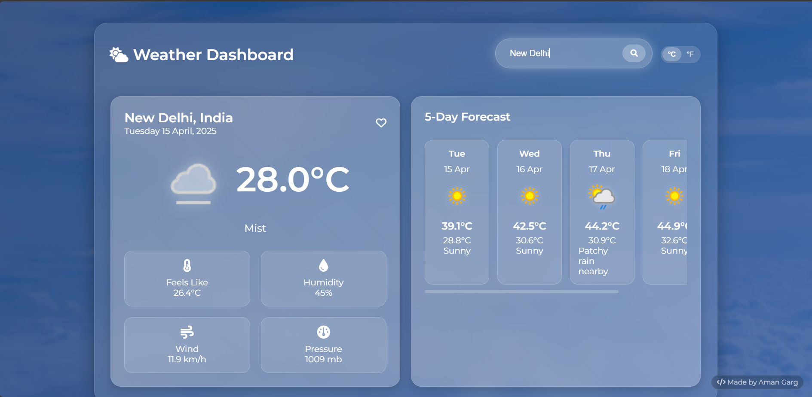

# Weather Dashboard



## Description

Weather Dashboard is a modern, responsive web application that provides real-time weather information and forecasts for locations worldwide. Built with HTML, CSS, and JavaScript, this application offers a sleek, intuitive interface for users to check current weather conditions and 5-day forecasts for any city.

## Features

- **Real-time Weather Data**: Access current weather conditions including temperature, humidity, wind speed, and atmospheric pressure
- **5-Day Forecast**: View weather predictions for the next five days
- **Temperature Unit Toggle**: Switch between Celsius and Fahrenheit with a single click
- **Favorites System**: Save your frequently checked locations for quick access
- **Dynamic Backgrounds**: Weather-themed backgrounds that change based on current conditions
- **Responsive Design**: Fully optimized for all devices including desktops, tablets, and mobile phones
- **User-Friendly Interface**: Clean, modern UI with smooth animations and intuitive controls

## Demo

View the live demo [here](https://github.com/Amangarg5990/Check-Weather-Report)

## Technologies Used

- HTML5
- CSS3 (with advanced features like CSS Grid, Flexbox, and Animations)
- JavaScript (ES6+)
- [WeatherAPI](https://www.weatherapi.com/) for weather data
- Font Awesome for icons
- Google Fonts

## Installation

1. Clone the repository:
   ```bash
   git clone https://github.com/Amangarg5990/Check-Weather-Report.git
   ```

2. Navigate to the project directory:
   ```bash
   cd Check-Weather-Report
   ```

3. Open the `index.html` file in your browser or use a live server extension if you're using VS Code.

## Usage

1. Enter a city name in the search box and press Enter or click the search icon
2. View the current weather and 5-day forecast for the searched location
3. Toggle between Celsius and Fahrenheit using the unit toggle buttons
4. Add locations to favorites by clicking the heart icon
5. Click on a favorite location to quickly load its weather information

## API Key

The application uses WeatherAPI for fetching weather data. To use your own API key:

1. Register for a free API key at [WeatherAPI](https://www.weatherapi.com/)
2. Replace the `apiKey` value in the JavaScript code with your own key:
   ```javascript
   const apiKey = "ee1b52c4d0104c50b3f81430250504";
   ```

## Customization

You can easily customize the application by:

- Changing the color scheme in the CSS variables
- Adding additional weather details to display
- Modifying the forecast display format
- Adding new features like weather alerts or historical data

## Browser Support

- Chrome (latest)
- Firefox (latest)
- Safari (latest)
- Edge (latest)
- Opera (latest)

## Contributing

Contributions are welcome! Please feel free to submit a Pull Request.

1. Fork the repository
2. Create your feature branch (`git checkout -b feature/amazing-feature`)
3. Commit your changes (`git commit -m 'Add some amazing feature'`)
4. Push to the branch (`git push origin feature/amazing-feature`)
5. Open a Pull Request

## License

This project is licensed under the MIT License - see the [LICENSE](LICENSE) file for details.

## Acknowledgments

- Weather data provided by [WeatherAPI](https://www.weatherapi.com/)
- Icons by [Font Awesome](https://fontawesome.com/)
- Fonts by [Google Fonts](https://fonts.google.com/)
- Background images from [Unsplash](https://unsplash.com/)

## Contact

Your Name - [amangarg5990@gmail.com](amangarg5990@gmail.com)

Project Link: [https://github.com/Amangarg5990/Check-Weather-Report)](https://github.com/Amangarg5990/Check-Weather-Report)

---

Made with ❤️ by Aman Garg
